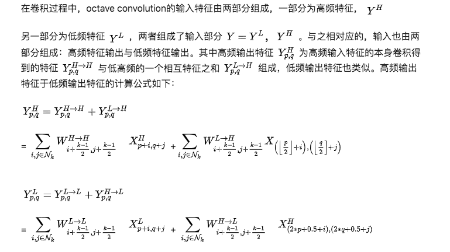

reference: 
- https://zhuanlan.zhihu.com/p/62598364  
- https://export.arxiv.org/abs/1904.05049

### code

--

###### def OctConv(hf_data, lf_data, settings, ch_in, ch_out, name, kernel=(1,1), pad=(0,0), stride=(1,1)):
    alpha_in, alpha_out = settings
    hf_ch_in = int(ch_in * (1 - alpha_in))
    hf_ch_out = int(ch_out * (1 - alpha_out))

    lf_ch_in = ch_in - hf_ch_in
    lf_ch_out = ch_out - hf_ch_out

    if stride == (2, 2):
        hf_data = mx.symbol.Pooling(data=hf_data, pool_type='avg', kernel=(2,2), stride=(2,2), name=('%s_hf_down' % name))
    hf_conv = Conv(data=hf_data, num_filter=hf_ch_out, kernel=kernel, pad=pad, stride=(1,1), name=('%s_hf_conv' % name))
    hf_pool = mx.symbol.Pooling(data=hf_data, pool_type='avg', kernel=(2,2), stride=(2,2), name=('%s_hf_pool' % name))
    hf_pool_conv = Conv(data=hf_pool, num_filter=lf_ch_out, kernel=kernel, pad=pad, stride=(1,1), name=('%s_hf_pool_conv' % name))

    lf_conv = Conv(data=lf_data, num_filter=hf_ch_out, kernel=kernel, pad=pad, stride=(1,1), name=('%s_lf_conv' % name))
    if stride == (2, 2):
        lf_upsample = lf_conv
        lf_down = mx.symbol.Pooling(data=lf_data, pool_type='avg', kernel=(2,2), stride=(2,2), name=('%s_lf_down' % name))
    else:
        lf_upsample = mx.symbol.UpSampling(lf_conv, scale=2, sample_type='nearest',num_args=1, name='%s_lf_upsample' % name)
        lf_down = lf_data
    lf_down_conv = Conv(data=lf_down, num_filter=lf_ch_out, kernel=kernel, pad=pad, stride=(1,1), name=('%s_lf_down_conv' % name))

    out_h = hf_conv + lf_upsample
    out_l = hf_pool_conv + lf_down_conv