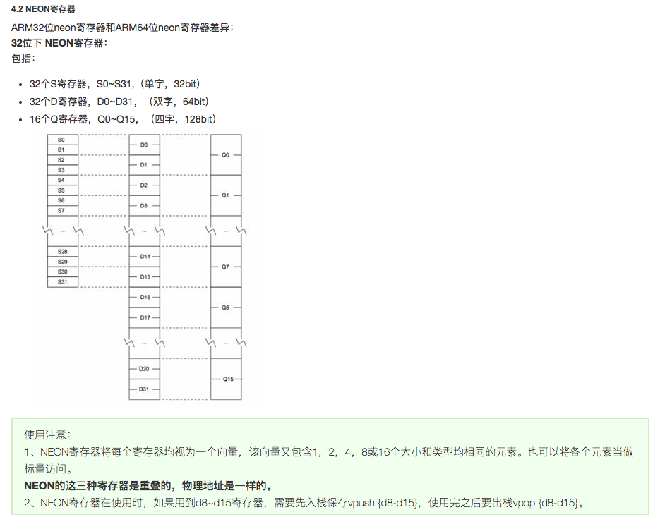
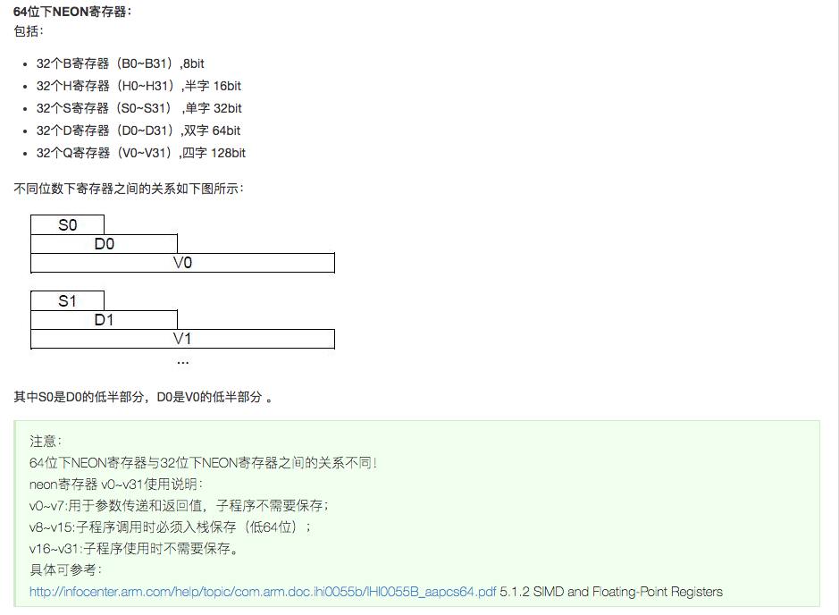

#### 如果arm为64位，则执行__aarch64__否则执行#else部分为32位

#ifdef __aarch64__

    if (nn > 0) {
        asm volatile(
            "0:                                         \n"
            "prfm           pldl1keep, [%1, #256]       \n"
            "prfm           pldl1keep, [%2, #256]       \n"
            "ld1        {v0.4s},  [%1],     #16         \n"
            "ld1        {v1.4s},  [%2],     #16         \n"

            "fmla       %3.4s,    v0.4s,    v1.4s       \n"

            "ld1        {v0.4s},  [%1],     #16         \n"
            "ld1        {v1.4s},  [%2],     #16         \n"
            "fmla       %4.4s,    v0.4s,    v0.4s       \n"
            "fmla       %3.4s,    v0.4s,    v1.4s       \n"
            "subs       %w0,      %w0,      #1          \n"
            "fmla       %5.4s,    v1.4s,    v1.4s       \n"
            "bne        0b                              \n"

            :"=r"(nn),
             "=r"(w0),
             "=r"(w1),
             "=w"(vector)
            :"0"(nn),
             "1"(w0),
             "2"(w1),
             "3"(vector)
            :"cc", "memory", "v0", "v1");
    }
#else

    if (nn > 0) {

        asm volatile (
            "0:                               \n"
            "pld    [%1,    #256]             \n"
            "pld    [%2,    #256]             \n"
            "vld1.f32   {d0-d1},    [%1]!     \n"

            "vld1.f32   {d2-d3},    [%1]!     \n"  //q0-q1

            "vld1.f32   {d4-d5},    [%2]!     \n" //q0-q2
            "vmla.f32   %q3,    q0,  q2       \n"

            "vld1.f32   {d6-d7},    [%2]!     \n" //q1-q3
            "vmla.f32   %q3,    q1,  q3       \n"

            "subs       %0,     #1            \n"
            "bne        0b                    \n"

            :"=r"(nn),
             "=r"(w0),
             "=r"(w1),
             "=w"(vector)
            :"0"(nn),
             "1"(w0),
             "2"(w1),
             "3"(vector)
            :"cc", "memory", "q0", "q1", "q2", "q3"); 
    }

pld，即预读取指令，pld指令只在armv5以上版本有效。使用pld指令可以提示ARM预先把cache line填充好。pld指令中的offset很有讲究。一般为64-byte的倍数。
功能：cache预读取（PLD,PreLoad），使用pld指示存储系统从后面几条指令所指定的存储器地址读取，存储系统可使用这种方法加速以后的存储器访问。
格式：pld[Rn,{offset}]
其中：
Rn         存储器的基址寄存器。
Offset     加在Rn上的偏移量。

1. 参考第一条指令："pld    [%1,    #256]  加载"1"(w0),  w0的数据，%1表示为w0指针的基址，#256 表示为每次提取4个64字节的数值
                 pld   [Rn=%1 offset=256]
 
2. 一次加载8个字节，d0-d7(q0-q3) 乘加操作，结果存储在q3中， subs       %0,     #1 对nn执行减一操作，bne        0b 相当于if语句，判断当前是否为0
部位0则跳转到0b位置（"0: \n"），即开头的位置，继续循环取值，计算。
3. :"=r" 为输入数据， "=w"(vector) 为输出数据，:"0"(nn),，表示%0代指nn。同比。

                 

一个q寄存器等于两个d寄存器