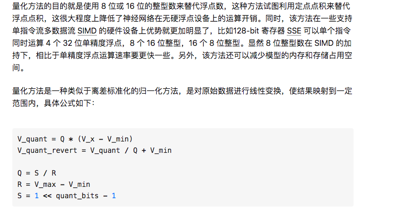
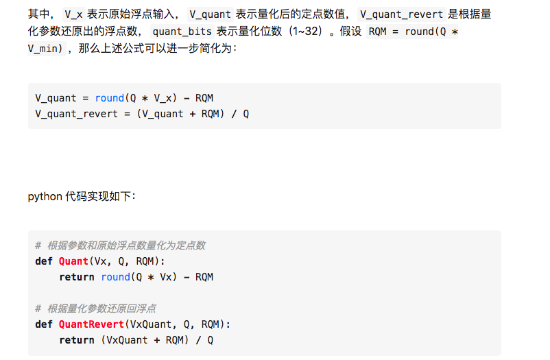
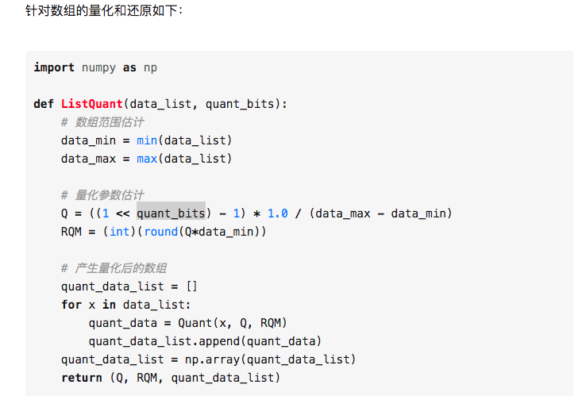
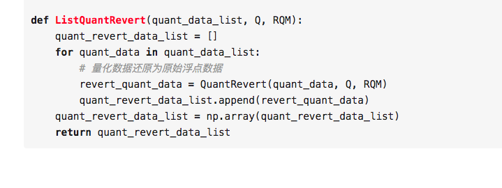
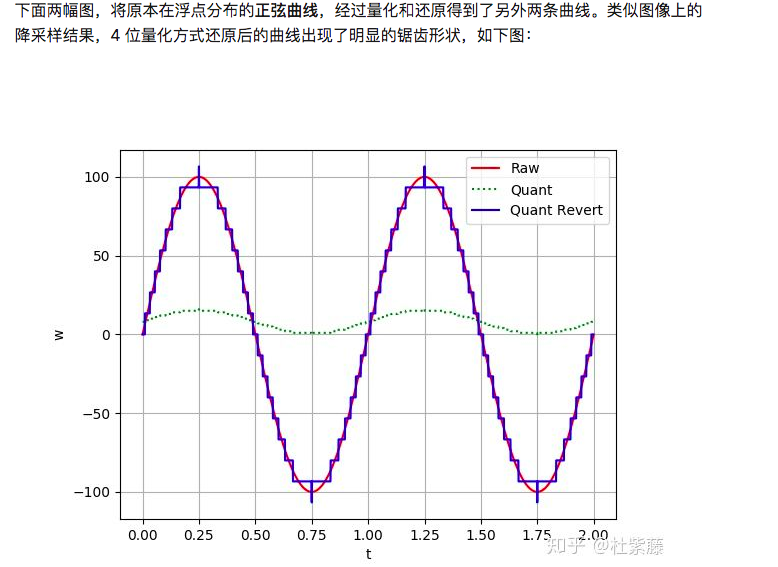
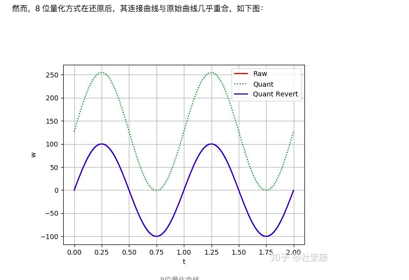
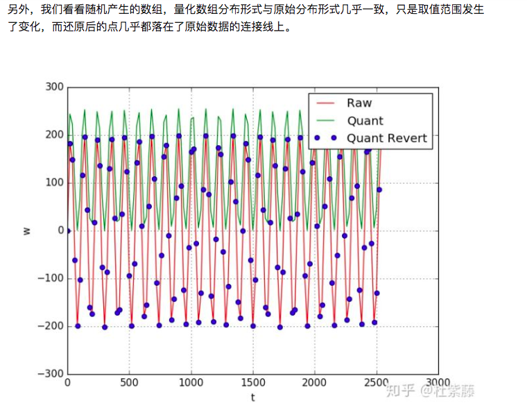
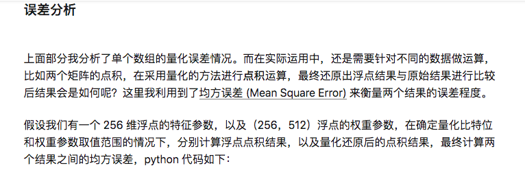

第一种方法：

https://hey-yahei.cn/2019/01/23/MXNet-RT_Quantization/index.html

Quantize weights
Quantizing weights is fairly simple, as the weights are fixed after the training and we know their min/max range. Using these ranges, the weights are quantized or discretized to 256 levels. Here is the code snippet for quantizing the weights and biases to 8-bit integers.

- min_wt = weight.min() 
- max_wt = weight.max()
# find number of integer bits to represent this range
- int_bits = int(np.ceil(np.log2(max(abs(min_wt),abs(max_wt))))) 
- frac_bits = 7-int_bits #remaining bits are fractional bits (1-bit for sign)
# floating point weights are scaled and rounded to [-128,127], which are used in 
# the fixed-point operations on the actual hardware (i.e., microcontroller)
- quant_weight = np.round(weight*(2**frac_bits))
# To quantify the impact of quantized weights, scale them back to
# original range to run inference using quantized weights
- weight = quant_weight/(2**frac_bits)
# Quantize activation data
# One approach for quantizing the activation data is to run inference on some representative input samples (or ideally, the entire dataset) and find the min/max range of each layer input/output. Using these ranges, the activation data can be quantized similar to the weights as shown in the above code snippet. Any outliers in the dataset may increase this range and may impact the accuracy, hence care must be taken in this approach. Other approach is to insert the TensorFlow Op "fake_quant_with_min_max_args" after every operation (convolution, addition, multiplication or concatenation) and find the optimal power of 2 min,max ranges that maximize the accuracy. This same approach can also be used for quantizing the weights. Furthermore, this modified model with fake_quant_with_min_max_args Op and frozen min,max ranges can be used for retraining/fine-tuning, which may increase the accuracy as the network will adapt to quantization.

# Quantizing KWS models
An example for quantizing DNN model is provided here. quant_test.py python script generates 8-bit quantized weights from the trained DNN model checkpoint and runs inference using quantized weights and floating-point activations on the entire dataset. It also dumps out the quantized weights into a text file (weights.h) which will be used while generating the binary for the Cortex-M board.

python quant_test.py --model_architecture dnn --model_size_info 144 144 144 --dct_coefficient_count 10 --window_size_ms 40 \
  --window_stride_ms 40 --checkpoint <path to trained model checkpoint>
After quantizing the weights, next step is quantizing the activation data or layer input/outputs. quant_models.py has fake_quant_with_min_max_args Op inserted with its min/max ranges exposed as commmand line arguments. Optimal activation range that maximizes the accuracy can be progressively determined for each layer starting from the input layer to the output layer. For example, to quantize the neural network input layer data (i.e. MFCC features) to the range [-32,32) while the other layer activations are left as floating point, run python quant_test.py <model-specific arguments and checkpoint file> --act_max 32 0 0 0 0. After the activations of all layers are quantized and we are satisfied with the accuracy, the model can be deployed by calling the optimized neural network kernels from CMSIS-NN with appropriate scaling parameters obtained from the quantization steps. For example, from quantization sweeps we get the input to the first fully-connected layer in DNN model is of Q5.2 format or 2 bits after the decimal point (i.e. ranges from -32,31.75) and the expected output format for maximum accuracy is also Q5.2. Using quant_test.py, we get the quantized weights are of the format Q0.7 (i.e. in range -1,1) and the quantized biases have 8 bits for fractional point (i.e. range -0.5,0.5). So, the product (layer_input x weights) will have 9 bits in the fractional part (Q5.2 x Q0.7 = Qx.9) and biases need to be shifted left by 1 to get to the same representation (i.e. Qx.8<<1 = Qy.9). The layer output has 2 bits for fractional part (Q5.2), so the product (layer_input x weights) needs to be shifted right by 7 to get to Q5.2 format.

Fusing batch-norm layers
The parameters of batch normalization layers that follow the convolution or fully-connected layers (i.e. mean, variance, scale factor and offset factors: see this for more details) can be fused into the corresponding convn/fc layer weights and biases, which saves both memory and inference time.

第二种方法：

-----
##### 误差分析

import numpy as np

def get_mse(quant_bits=12,

            feature_range=(0.0, 100.0),

            weight_range=(-1.0, 1.0),

            feature_dim=256,

            output_dim=512):

    # 产生随机数

    np.random.seed(42)

    feature = np.random.uniform(

        low=feature_range[0], high=feature_range[1], size=(feature_dim,))

    weight = np.random.uniform(

        low=weight_range[0], high=weight_range[1], size=(feature_dim*output_dim,))
    
    # 获取量化后的定点数组及其参数
    feature_Q, feature_RQM, feature_quant = ListQuant(feature, quant_bits)
    weight_Q, weight_RQM, weight_quant = ListQuant(weight, quant_bits)

    # 浮点数的点积
    float_dotprod = np.dot(feature, weight.reshape(feature_dim, output_dim))

    # 量化数的点积
    weight_quant = weight_quant + weight_RQM
    quant_dotprod = np.dot(feature_quant+feature_RQM,
                           weight_quant.reshape(feature_dim, output_dim))/(feature_Q*weight_Q)
    # 均方差计算
    mean_squared_error = ((float_dotprod - quant_dotprod) ** 2).mean()
    return mean_squared_error
    
    
##### 下面代码是针对不同的权重取值范围以及量化位数进行绘图描述：

if __name__ == '__main__':
    
    # 权重范围列表
    
    weight_range_list = [(-1.0, 1.0), (-2.0, 2.0), (-3.0, 3.0),
    
                         (-4.0, 4.0), (-5.0, 5.0), (-6.0, 6.0), (-7.0, 7.0)]

    for weight_range in weight_range_list:
    
        print "Weight Range: {}".format(weight_range)
    
        # 量化位数 8～16
    
        quant_bits_list = [i for i in xrange(8, 16+1)]

        mean_err_list = []
    
        for quant_bits in quant_bits_list:
    
            # 量化误差计算
    
            mean_err = get_mse(quant_bits, weight_range=weight_range)
    
            print "\tMean Squared Error: {} ({} bits)".format(mean_err, quant_bits)
    
            mean_err_list.append(mean_err)

        # 画出当前权重范围的量化误差曲线
    
        plt.plot(quant_bits_list, mean_err_list, label="Weight Range: {}".format(
    
            "~".join([str(i) for i in weight_range])))

    
    plt.xlabel('Quant Bits')
    
    plt.ylabel('Mean Squared Error')
    
    plt.grid(True)
    
    plt.legend()

    # 保存图片
    plt.savefig("q_mse.png")