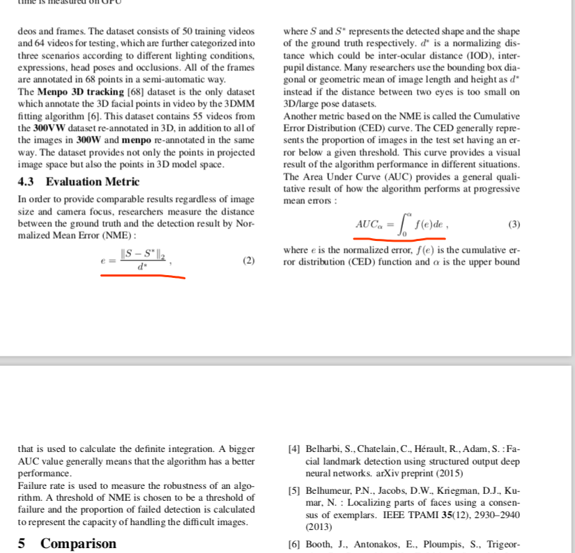
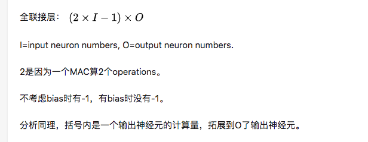

1.反卷积
反卷积的过程实际上是首先根据stride的值给输入插入零；插入的行、列数是stride - 1

然后在根据floor(filter_size/2)来补充边界，本例中filter_size = 3因此只需要往边上补充1行，列：
|1|2|
|3|4|   stride = 3 (插入两行两列)  --->|1|0|0|2|
                                       |0|0|0|0|
                                       |0|0|0|0|
                                       |3|0|0|4|
                         

   filter_size = 3.边上补0
  |0|0|0|0|0|0|    
  |0|1|0|0|2|0|
  |0|1|0|0|0|0|
  |0|0|0|0|0|0|
  |0|3|0|0|4|0|
  |0|0|0|0|0|0| 

空洞卷积 dialted conv
反卷积（转置卷积）
深度可分离卷积
全卷积
  
  全卷机
  
  
  蓝色是测试，绿色是grundtruth
  
  
  方差(variance)、标准差(std)、均方差(mse)
  
  
  方差(variance)
  1)方差：方差是在概率论和统计方差衡量随机变量或一组数据的离散程度的度量方式，方差越大，离散度越大。
  求解方式为，各随机变量与平均值差值的平方和的平均数（先求差，再平方，再平均）
  标准差(std)
  2）标准差：标准差就是方差的算术平方根，它反映组内个体间的离散程度。因此它的过程是与平均值之间进行差值计算。
  

  
  
 均方差(mse) Mean squared error
 
 MSE=SSE/n=1/n*∑(i=1~m)  wi*(yi−yi^)^2
 其中yi是真实数据，yi^是拟合的数据，wi>0从这里可以看出SSE越接近于0，说明模型选择和拟合更好，数据预测也越成功。
  
  
  
  
  
  
Pytorch的数据读取非常方便, 可以很容易地实现多线程数据预读. 我个人认为编程难度比TF小很多，而且灵活性也更高. (TF需要把文件名封装成list, 传入string_input_producer, 这样可以得到一个queue; 然后把这个queue给一个WholeFileReader.read(); 再把read()回来的value用decode_jpeg()解码; 然后再用一系列处理去clip, flip等等...)

Pytorch的数据读取主要包含三个类:

Dataset
DataLoader
DataLoaderIter
这三者大致是一个依次封装的关系: 1.被装进2., 2.被装进3.

一. torch.utils.data.Dataset

是一个抽象类, 自定义的Dataset需要继承它并且实现两个成员方法:

__getitem__()
__len__()
第一个最为重要, 即每次怎么读数据. 以图片为例:

    def __getitem__(self, index):
        img_path, label = self.data[index].img_path, self.data[index].label
        img = Image.open(img_path)

        return img, label
值得一提的是, pytorch还提供了很多常用的transform, 在torchvision.transforms 里面, 本文中不多介绍, 我常用的有Resize , RandomCrop , Normalize , ToTensor (这个极为重要, 可以把一个PIL或numpy图片转为torch.Tensor, 但是好像对numpy数组的转换比较受限, 所以这里建议在__getitem__()里面用PIL来读图片, 而不是用skimage.io).

第二个比较简单, 就是返回整个数据集的长度:

    def __len__(self):
        return len(self.data)
二. torch.utils.data.DataLoader

类定义为:

class torch.utils.data.DataLoader(dataset, batch_size=1, shuffle=False, sampler=None, batch_sampler=None, num_workers=0, collate_fn=<function default_collate>, pin_memory=False, drop_last=False)
可以看到, 主要参数有这么几个:

dataset : 即上面自定义的dataset.
collate_fn: 这个函数用来打包batch, 后面详细讲.
num_worker: 非常简单的多线程方法, 只要设置为>=1, 就可以多线程预读数据啦.
这个类其实就是下面将要讲的DataLoaderIter的一个框架, 一共干了两件事: 1.定义了一堆成员变量, 到时候赋给DataLoaderIter, 2.然后有一个__iter__() 函数, 把自己 "装进" DataLoaderIter 里面.

def __iter__(self):
        return DataLoaderIter(self)

三. torch.utils.data.dataloader.DataLoaderIter

上面提到, DataLoaderIter就是DataLoaderIter的一个框架, 用来传给DataLoaderIter 一堆参数, 并把自己装进DataLoaderIter 里.

其实到这里就可以满足大多数训练的需求了, 比如

class CustomDataset(Dataset):
   # 自定义自己的dataset

dataset = CustomDataset()
dataloader = Dataloader(dataset, ...)

for data in dataloader:
   # training...
在for 循环里, 总共有三点操作:

调用了dataloader 的__iter__() 方法, 产生了一个DataLoaderIter
反复调用DataLoaderIter 的__next__()来得到batch, 具体操作就是, 多次调用dataset的__getitem__()方法 (如果num_worker>0就多线程调用), 然后用collate_fn来把它们打包成batch. 中间还会涉及到shuffle , 以及sample 的方法等, 这里就不多说了.
当数据读完后, __next__()抛出一个StopIteration异常, for循环结束, dataloader 失效.

如果数据分散想把这些数据整合到一起，但又不能动原始数据，和copy数据，所以需要为这些分散的数据建立软连接，时期整合到一起
为 /world/data-gpu-63/alignment/300W  添加软链接， 
ln -s  /world/data-gpu-63/alignment/300W  300w  

删除软链接
rm -rf ./300w

访问300w 和访问/world/data-gpu-63/alignment/300W 一样

重点注意：创建软链接时，软连接的名字不能和原数据的名字相同，否则删除软连接的同时也删除了原始数据

自适应avgpooling
F.adaptive_avg_pooling()

ipython 中查看包函数对应的源码
1.ipython
2. from facemarks import pose
3.pose?? 可以查看pose.py中源码

lmbench  测试中，针对98个关键点的测试为benchmark_facemarks_wflw.py

秩序添加对应的pth 模型，和修改对应的landmark点的数目，即可。
lmbench  也依赖于项目faceseg-pytorch ,即在声明model和加载param时model.load_state_dict()
所以报保持对应的模型定义文件在faceseg-pytorch  项目中。

欧拉角，
http://chenbinpeng.com/2016/10/26/%E6%AC%A7%E6%8B%89%E8%A7%92/
https://www.cnblogs.com/21207-iHome/p/6894128.html
https://blog.csdn.net/u013512448/article/details/77804161

一般的关于landmark数据集的文件中，关键点坐标为[x,y]或者[x,y,z]
拿到这个坐标后如果要计算人脸的pose，欧拉角，则首先需要讲2d或者3d人脸的关键点
normal，其实就是将 x /= width(img)  y /= height(img) 关于图像的宽高cv2读图片集合或者图片的维度
然后估计pose， 但是在计算pose前需要确认，人脸关键点数据集中坐标的序列是否和pose模型想匹配，
如果不匹配，则需要通过数据集的轮廓坐标序列的大小变换，得出对应的坐标系，然后和计算pose角度使用的模型的坐标系进行对比
如果相反，则乘以-1来讲坐标轴翻转，如果坐标系完全不同，则需要将关键点的坐标序列调换等等方式来匹配计算pose角度建模使用的坐标系。

传统的解决大角度pose问题的方法：
1. 恢复3d模型，通过landmark的3dshape 计算出2d图像的pose，
2. 使用3d模型，合成更多各种角度的2d图像用于训练
3. 多任务

pytorch 自定义loss的时候：

class WingLoss(nn.Module):
    def __init__(self):
        super(WingLoss, self).__init__()
        self.w = 10.0
        self.epsilon = 2.0
        self.c =  self.w * (1.0 - math.log(1.0 + self.w / self.epsilon))
    def forward(self, mks, labels):
        loss = {公式的实现}
        return loss.mean()

在外面声明使用只需：loss = WingLoss()(predict, labels)会自动调用forward() 因为该类是继承nn.Moudel的

lmbench 测试benchmark的时候，如果训练出来的模型未加增强，则在测试的时候benchmark_facemarks_wflw.py 中WLFW的对象声明
和transform中要将pad该为0.5  默认为0.2
如果加了增强则不需要修改，因为random_scale

In PyTorch, images are represented as [channels, height, width], so a color image would be [3, 256, 256].

train loss 不断下降，test loss不断下降，说明网络仍在学习;

train loss 不断下降，test loss趋于不变，说明网络过拟合;

train loss 趋于不变，test loss不断下降，说明数据集100%有问题;

train loss 趋于不变，test loss趋于不变，说明学习遇到瓶颈，需要减小学习率或批量数目;

train loss 不断上升，test loss不断上升，说明网络结构设计不当，训练超参数设置不当，数据集经过清洗等问题
--------------------- 
作者：ShellCollector 
来源：CSDN 
原文：https://blog.csdn.net/jacke121/article/details/79874555 
版权声明：本文为博主原创文章，转载请附上博文链接！

直接回归landmarks关键点模型训练心得

1。 直接回归loss的影响对收敛影响较大，直接使用mse、l1、l2等传统的回归loss对关键点的离群点等较为敏感，
    使用wingloss，既可以放大较小loss也可以降低较大loss，即不对离群点敏感，也会加速收敛。因为其采用分段函数，
2.  学习率，当loss不下降的时候，试试跳大学习率使其跳出局部最优

3. 关键点抖动，因为直接回归关键点，使得关键点的整体性较强，一个点的抖动会带动所有关键点的抖动，因此要尽量增加各个关键点的local
    方法1：利用shufflenet2 各个阶段的输出，结合形成hms，讲该hms和关键点的loss做和，这样可以单独训练shufflenetv2 各阶段对应的卷积核参数
    增强局部性。
    方法2：削弱关键点loss的占比。
4. 关键点的抖动

测量 98个关键点代码：benchmark_facemarks_wflw.py
测量 68个关键点代码：benchmark_facemarks.py

pytorch剪切模型,按照关键字去除掉不要的节点
1. ckpt = torch.load('./xx.pth')
2. res = {k:ckpt[k] for k in ckpt.keys() if 'xx' not in k}
3. torch.save(res, './xxx.pth')

板卡测速：
./bench  200 6 0  model_bin model_param  img_width  img_height  input_node  output_node
./bench  200 6 0  mobile_v2.bin  mobile_v2.param  128 128 0 484

./test_shell mobile_v2_96.bin  mobile_v2_96.param 96 96 0 484

报错误： dataloader 没有加载到数据，可能的错误是，是否正确读取到数据。查看数据路径是否正确等。
ValueError: num_samples should be a positive integeral value, but got num_samples=0

将模型重新load并走inference查看结果时，pytorch 应该将声明的model执行model.eval(),由此inference的记过避免dropout等操作的干扰，
在将该模型导成onnx时，也需要执行model.eval()避免dropout的干扰

pytorch导入模型并查看inference执行的中间任何结果时，应该，首先将声明网络结构的定义，然后载入模型，然后执行model的forward，并且
在网络结构的定义的forward的函数内，将需要查看的结果print打印出来，则在model执行inference的过程中，该结果会打印出来，

定义一个新的网络，该网络包含两个子网络，则，在load两个子网络的model的时候，怎样将其融合成一个model？
1. 首先定义新网络的mode
2. load 两个子网络model
3. 根据新网络的keys来融合两个子模型的keys，以达到新网络model的state_dict的定义需求。
关于 inference和融合model的操作查看export_onnx 文件。

pytorch冻结部分网络使其不会传梯度，只训练一部分网络的步骤：
1. 加载pretrain模型，可能部分keys不满足条件，需要过滤keys 
    model = getattr(models, opt.model)(n_class=opt.num_mks)
    model_dict = model.state_dict()
    state_dict = torch.load(opt.init_ckpt)
    model_dict.update(state_dict)
    model.load_state_dict(model_dict, True)
2. 冻结部分网络：
def get_optimizer(model):
    for param in list(model.parameters())[:-3]:
        param.requires_grad = False
    params = filter(lambda p: p.requires_grad, model.parameters())
    optimizer = torch.optim.SGD(params, lr=opt.lr,momentum=opt.momentum,weight_decay=opt.weight_decay)
    return ScheduledOptim(optimizer)
    

1  .  imageme -p 9001 -n 4  每行显示4张图片

2. 计算pose 查看/home/fenghui/fgm    facemark  utils.pose_estimation
3. 编写新的dataset 查看 fgm下面的menpo或者vis_test

世界坐标系到相机坐标系的转化，用于计算pose
https://zhuanlan.zhihu.com/p/35287729

人脸姿态估计：
 Head Pose Estimation 算法的步骤一般为：2D人脸关键点检测；3D人脸模型匹配；求解3D点和对应2D点的转换关系；根据旋转矩阵求解欧拉角。Bingo！就是这么简单。 
 https://www.zhihu.com/search?type=content&q=%E4%BA%BA%E8%84%B8%E5%A7%BF%E6%80%81%E8%A7%92%E7%9A%84%E8%AE%A1%E7%AE%97
 基于模型的估计方法的前提是，手头必须具备两样东西，一个是人脸特征点（眼镜，嘴巴，鼻子等处的像素位置），另外一个，是需要自己制作一个3维的，正面的“标准模型”
 
 算法最重要的还是思想，其余诸如流程什么的，都是实现思想的手段而已。人脸姿态估计的思想：旋转三维标准模型一定角度，直到模型上“三维特征点”的“2维投影”，
 与待测试图像上的特征点（图像上的特征点显然是2维）尽量重合。这时候我们脑海中就应该浮现出一种诡异的场景：
 在幽暗的灯光中，一个发着淡蓝色光芒的人皮面具一点点的“自我调整”，突然一下子“完美无缺”的“扣在了你的脸上”。这就是人脸姿态估计的思想。
 

得到旋转矩阵后的欧拉角计算：

#####关键点评测指标：NME和AUC：

横坐标表示归一化误差值e，纵坐标表示小于归一化误差e的特征点占所有特征点的比例。
值得一说的是，该方法的好处就在于的值不像平均误差那样受单个点误差较大而发生较大变化，非常敏感。

对于所有的测试图片，获取到的预测值存储在一个tensor中，表示着这些图片的预测关键点的坐标值，
根据该tensor计算和groundtruth 计算所有点的归一化误差，存储在另一个tensor中，每个点表示该点和groundtruth中对应的图的该点的归一化误差
二CED曲线的画法为：对于给定的一个归一化误差范围[0,0.3]，在该范围内，计算该tensor中所有预测值的68个关键点中和groundtruth 关键点的
归一化误差小于该给范围内某个点的归一化误差值的比例。一次类推，，可以画出CED曲线，该CED曲线和下面的归一化误差范围[0,0.3所围的面积即为AUC

######nme

######def calc_nme(pts98_all, gtxy, roi_boxs):
    roi_boxs = roi_boxs.type(torch.FloatTensor)
    std_size = 256

    nme_list = []

    for i in range(len(roi_boxs)):
        pts98 = pts98_all[i]
        gt98 = gtxy[i]
        gt98 = gt98.transpose(1, 0)

        sx, sy, ex, ey = roi_boxs[i]
        scale_x = (ex - sx) / std_size
        scale_y = (ey - sy) / std_size
        pts98[0, :] = pts98[0, :] * scale_x + sx
        pts98[1, :] = pts98[1, :] * scale_y + sy

        minx, maxx = torch.min(pts98[0, :], dim=0)[0], torch.max(pts98[0, :], dim=0)[0]
        miny, maxy = torch.min(pts98[1, :], dim=0)[0], torch.max(pts98[1, :], dim=0)[0]
        llength = torch.sqrt((maxx - minx) * (maxy - miny))

        dis = pts98 - gt98
        dis = dis ** 2
        dis = torch.sum(dis, dim=0, keepdim=False)
        dis = torch.sqrt(dis)
        dis = torch.mean(dis)
        nme = dis / llength
        nme = nme.cpu().data.numpy()
        nme_list.append(nme)

    return nme_list
    
    
    
    
######auc

######def get_edf_histogram(nme_list, xy, thr_=0.3):
    nerr = np.float32(nme_list)
    num_ps = float(nerr.flatten().shape[0])
    hist, bin_edges = np.histogram(nerr.flatten(), bins=5000,range=(0,thr_))
    CDF = np.insert(np.cumsum(hist)/num_ps,0,0)
    area = np.sum(CDF[1:]*np.diff(bin_edges))
    return area, bin_edges, CDF

#####分类性能指标：https://blog.csdn.net/quiet_girl/article/details/70830796

#####FLOPs卷积和全连接计算公式

######shufflenetv1-v2

#####landmaek(face alignment 数据集)
1. controlled pose variation like the ones of LFPW [2], Helen [22] and 300-W [30].
2. 

论文导读：
1. Robust Facial Landmark Detection via Occlusion-adaptive Deep Networks
### landmark 方法：
1. 模板方法（template methods）
2. 坐标回归（cnn+loss回归坐标）
3. heatmap 
 
 