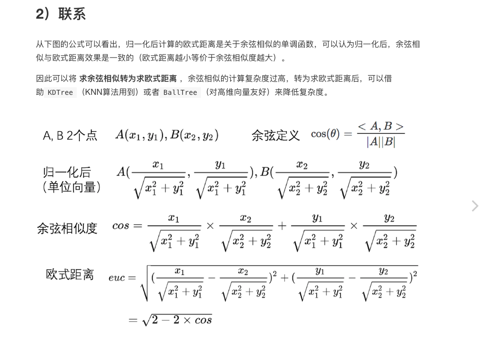

终端显示图片：
python提供了一个SimpleHTTPServer,我们只需要在放有图片的路径下输入：python -m SimpleHTTPServer

mxnet操作数据集
1 .lst  
python ~/mxnet_1.1.0/tools/im2rec.py  --list --train-ratio 0.8  --recursive --resize 32 /home/fenghui/prefix  /home/fenghui/casia_clean_train/

将图片路径/home/fenghui/casia_clean中的图片 按照 训练数据80%，验证数据20%的比例生成两个lst文件，名字分别为prefix_train.lst，prefix_val.lst，
存放在指定的路径/home/fenghui/，prefix为生成的lst的文件名前缀,如果训练的图片尺寸不符合网络要求的尺寸，可以 指定 --resize 调整图片的尺寸

2 .rec:
python ~/mxnet_1.1.0/tools/im2rec.py  --num-thread 8 /home/fenghui/prefix casia_clean_train/

/home/fenghui/prefix为生成的lst文件的前缀，casia_clean_train/ 为训练图片的路径

生成四个文件：prefix_test.rec prefix_train.rec,prefix_train.idx,prefix_test.idx

致辞数据准备完成！！！

mxnet 网络搭建
1.创建数据流
train_iter = mx.io.ImageRecordIter(
                  path_imgrec="prefix_train.rec",
                  data_shape=(3,32,32),
                  batch_size=1000,
                   )
train_iter = mx.io.ImageRecordIter(
                  path_imgrec="prefix_test.rec",
                  data_shape=(3,32,32),
                  batch_size=1000,
                   )
初始化网络的数据数据变量
data = mx.symbol.Variable('data')
卷积操作
conv = = mx.symbol.Convolution(data = data ,kernel=(5,5), num_filter=20)(卷积)
tanh = mx.symbol.Activation(data = conv1, act_type="tanh")(经过激活函数)
pool = mx.symbol.Pooling(data = tanh1,pool_type="max",kernel=(2,2), stride=(2,2))（max-pooling）

卷积输出到全连接：
数据转化：[batch,channel,length,width]---->[batch,list]
flatten = mx.symbol.Flatten(data = pool)

全连接层：
 mx.symbol.FullyConnected(data=flatten, num_hidden=500)
全连接的输出层后面跟着softmax
fc2 =  mx.symbol.FullyConnected(data=tanh, num_hidden=2)
接softmax
fc2 =  mx.symbol.FullyConnected(data=tanh, num_hidden=2)
fc2即为最终的输出

预处理：pre
Alignment
关键点的计算

仿射矩阵（原始图关键点和结果图关键点的差距通过仿射矩阵弥补）， 5个关键点---
Affline 
Similarity
landmark

map，

gap

lenet   resnet
长尾

ps -ef |grep -w 'tt.py'|grep -v grep|cut -c 9-15|xargs kill -9  杀死tt.py程序对应的所有进程

ls  -l | wc -l 统计目录数
ls | wc -c 统计当前目录下所有的文件数量

find /home/fenghui/casia_clean_train -name *.jpg > ../cas.txt  生成mxnet数据输入源的路径列表，

python ~/mxnet_1.1.0/tools/im2rec.py  --num-thread 8 open_40w_rec_test.lst ./ 将.lst文件转化为rec

显示图片尺寸：im = Image.open('lena.png')  im.size ,显示对应图片的尺寸

tensorboard --logdir=./logs --host=127.0.0.1 --port=8888  使用mxboard 查看

CUDA_VISIBLE_DEVICES=1 python alexnet.py  指定1号GPU运行

筛选文本同名时，首先将新下载的文件，转写一遍，然后从新的文件里读取，与political_end1.txt文件中的名字对比。

训练模型时，卡了很久没有输出，时因为没有设置logg的模式,-->logging.basicConfig(level=logging.DEBUG),即可看到输出

使用git 的时候，如果要提交哪个项目 ，先进入该项目文件夹，然后执行git命令的顺序为：git pull ---> git add .----->git commit -m "" ---->git push origin master 

batch_end_callbacks= mx.callback.Speedometer(batch_size,100) ,在每个epoch中，每隔100个batch输出一次，监视器监视的结果，只有当设计logg的模式为
logging.basicConfig(level=logging.DEBUG) 才可以看到输出,,batch_size为每次取数据的快大小，比如设置batch_size=1000，则每个batch含有1000个数据

lr_sch = mx.lr_scheduler.FactorScheduler(step=50, factor=0.9)  设置每隔50个batch，更新一次学习率，每次乘以0.9, 

双线性插值

opencv的resize

find ./ -name "identify" | wc -l   查找 文件名为 “identify” 的数量

c++调用python
main.cpp中#include<Python.h>,
然而Python.h 可能不再/usr/include目录中，因此找到Python.h所在的路径在g++编译的时候添加进去。如下编译命令所示：
g++ -std=c++11 -o main   main.cpp -I/usr/include/python2.7  -L/usr/lib/python2.7 -lpython2.7

g++ -std=c++11 libfrvt11_null_001_cpu.cpp -shared -fPIC -o libfrvt11_null_001_cpu.so

g++ -std=c++11 libfrvt11_null_001_cpu.cpp -shared -fPIC -o libfrvt11_null_001_cpu.so  -I/usr/include/python2.7  -L/usr/lib/python2.7 -lpython2.7

du -sh * 查看目录下所有文件的大小

召回率，人脸召回

TPIR/FPIR
FMR
FNMR
FAR

机器学习：FPIR/TPIR的统计图

ssd （detection）

对于tensorflwo 框架来说，如果不能启动gpu 则尝试
sess = tf.Session(config=tf.ConfigProto(log_device_placement=True)),使用sess 启动计算图

动态导入包
importlib.import_module('des') 

僵尸进程：状态号：Z
进程已经释放所有的资源，但是没有被父进程释放。僵尸进程要等到父进程结束，或者重启系统才可以被释放。
一般我们要在父进程中调用waitpid（）函数，来终止子进程，以免进程变成僵尸进程
ps -aux | grep "z"，可以查看系统中的僵尸进程，僵尸进程不可被kill 杀死，有两种方法杀死：
1.找到该僵尸进程的父进程，杀死父进程，释放进程号： cat /proc/4385/status   找到该子进程对应的父进程，将其父进程杀死，如果父进程也杀不死，则只能重启
2.重启

孤儿进程：孤儿进程则是指父进程结束后仍在运行的子进程。在类UNIX系统中，孤儿进程一般会被init进程所“收养”，成为init的子进程。

1. Linux进程状态：R (TASK_RUNNING)，可执行状态&运行状态(在run_queue队列里的状态)

2. Linux进程状态：S (TASK_INTERRUPTIBLE)，可中断的睡眠状态, 可处理signal

3. Linux进程状态：D (TASK_UNINTERRUPTIBLE)，不可中断的睡眠状态,　可处理signal,　有延迟

4. Linux进程状态：T (TASK_STOPPED or TASK_TRACED)，暂停状态或跟踪状态,　不可处理signal,　因为根本没有时间片运行代码

5. Linux进程状态：Z (TASK_DEAD - EXIT_ZOMBIE)，退出状态，进程成为僵尸进程。不可被kill,　即不响应任务信号,　无法用SIGKILL杀死

STAT对应的字符含义如下表所示：

STAT_Code	Description
R	        正在运行或者有能力运行。
D	        不间断的睡眠 (等待中) - 通常是为了等待完成输入输出。
S	        睡眠中. 通常是在等待一个事件, 例如一个信号或者输入变成可获得的。
T	        已停止. 通常是被shell的job控制了或者正在被一个调试器进行调试。
Z	        死亡/失效的僵尸进程.
N	        低优先级, nice（译者注：nice后面会提到）.
W	        分页.
s	        这个进程是会话中的首进程.
+	        这个进程在前台工作组中。
l	        这个进程是多线程的。
<	        高优先级的任务。

查看进程是否在运行: ps  -ef|grep process_name

multi_task   ----》性别年龄（）

mxnet 中op自定义，并添加到网络中，在网络中调用的centerloss 为自定义的op操作：

center_loss_ = mx.symbol.Custom(data=embedding, label=center_label, name='center_loss_', op_type='centerloss',\
            num_class=10, alpha=0.5, scale=1.0, batchsize=batchsize)
            
            
自定义的op操作centerloss 为prop返回的类对象，该对象定义了op的操作。

结果拿来-----》识别--->

tmux下无法滚屏很烦人。 一句话就解决了: CTRL + B 再按 \”[\”，这时就可以用光标键来操作翻页滚屏 

prelu

tpir(0~1)@fpir(10^-1 。。递减 。。10^-6)

mAP(0~1) @ threshold(0~2 )

git clone -b parallel git@git.tuputech.com:FRG/dazzle.git   拉取指定分支

图坐标系和常规坐标系的y轴相反

根据PID 查找执行的任务，

ls /proc/PID --》cd /proc/PID --》ls -ail
 
 
 
 mobileunet

如果pip安装工具时出现以下错误：
TypeError: cannot concatenate 'str' and 'NoneType' objects
则修改pip源或者将~/.pip/pipconf 直接删除，默认使用官方的源

如果pip  install 或者 uninstall 时出现：
IOError: [Errno 2] 没有那个文件或目录: '/home/fenghui/.local/lib/python2.7/site-packages/torch-0.4.1.dist-info/RECORD'
则跳至/home/fenghui/.local/lib/python2.7/site-packages目录下，删除torch-0.4.1.dist-info 目录，然后在继续pip安装
或者proxychain4

安装公司内部的pip 仓库里面的工具（facemarks）
pip2 install facemarks -i http://pypiserver.tupu.local/simple --trusted-host pypiserver.tupu.local --user

安装tensorboardX  观察loss变化：
pip install tensorboardX==1.4

指定loss日志的地址：
tensorboard --logdir=[yourlogdir]
tensorboard --logdir=/world/data-gpu-94/fenghui/mhg_log/occ_0.4_init/vis/mhg/debug_metric_false

浏览器打开：http://172.26.3.94:6006/

安装pytorch -gpu版，前提需要cuda，并且在brac_profil中配置了cuda的路径
https://pytorch.org/get-started/locally/

cuda 环境变量：
export PATH=$PATH:/usr/local/cuda-8.0.61/bin
export CUDA_HOME=$CUDA_HOME:/usr/local/cuda-8.0.61

k8s 上启动训练，需要：
1。将训练代码移植到/world/data-c2/huifeng.
2.修改tensorboard 和训练代码的访问权限，使k8s可以访问，
3.写一个start.sh脚本。启动训练，例如:CUDA_VISIBLE_DEVICES=1,2,3,4 python  /world/data-c2/huifeng/faceseg-pytorch/train_mhg_mks.py train
4.需要训练提示缺少包，可以直接在start.sh启动训练代码之前执行一些shell 命令来安装，例如：以下脚本是一个启动训练的sh：
pip install tqdm --user
pip install facemarks  -i http://pypiserver.tupu.local/simple --trusted-host pypiserver.tupu.local --user
pip install fire --user
CUDA_VISIBLE_DEVICES=1,2,3,4 python  /world/data-c2/huifeng/faceseg-pytorch/train_mhg_mks.py train
5.日志的输出目录或者tensorboard的日志为了方便访问，需要写绝对路径，
6.将训练代码，脚本，数据，日志等设计到的磁盘全部挂载

如果遇到权限问题而不能安装工具，则直接拉github项目，编译，安装即可。

如果你想在当前目录下 查找"hello,world!"字符串,可以这样:
grep -rn "hello,world!" *

使用ipython 调试
ipython
Run the program Simpson.py with the debugger on (-d):
run -d Simpson.py

如果pip 直接安装不上安装包，可以去官网下载指定的.whl包，直接执行 pip install --user xxx.whl 包也可以安装。

pytorch 在导出onnx时，如果需要导出的网络分段了，需要用deepcopy将两端网络拷贝
self.features_prev = deepcopy(self.features[0:8])
self.features_last = deepcopy(self.features[8:])
然后两端网络后面可分别接其他的网络，又或者self.features_prev  后接一个分支网络做其他任务，
所以prev输出的值可分别输入到分支网络，和self.features_last  做不能任务
https://github.com/pytorch/pytorch/issues/8392

在库中搜索目标函数
fgrep "Registry" libtvm.a

在当前目录中搜索包含xxx的文件
fgrep -r "xxx"
fgrep "439"  dpdm.log | wc -l  过滤文件dpdm.log中字符串“439” 并统计其数量

卷积运算加速：
普通的卷积运算转化为：
1. im2col -> gemm 将卷积核和feature map都转化为矩阵，然后使用gemm，矩阵计算函数来加速卷积计算
2. Winograd 计算：http://shuokay.com/2018/02/21/winograd/

查看在办卡上运行的程序是否有内存泄露：
1. 在办卡上循环运行程序
2. 在本地 adb top shell > xx.log 将top信息重定向到xx.log
3. 过滤出包含该程序的行，
4. 查看改程序对应的RSS有没有在循环的过程中在增长。如果有增长则存在内存泄露
5. ncnn挨个节点运行，获取top的log，查看log是否有内存增长，直至找到那个内存泄漏的节点，然后修改节点对应的operator

将排序好的文件夹内的前50个文件查找出来，并拷贝到另外一个目录中，
find ./ -name "*.jpg" | sort  | head -n 50  | xargs -I {} cp {} ../frames_sub

余弦相似度和欧式距离的换算

winograd 卷积加速算法
https://www.cnblogs.com/shine-lee/p/10906535.html

快速傅里叶变换
http://blog.miskcoo.com/2015/04/polynomial-multiplication-and-fast-fourier-transform

编译openc静态库
cmake -D CMAKE_BUILD_TYPE=RELEASE -D CMAKE_INSTALL_PREFIX=/usr/local -D BUILD_SHARED_LIBS=OFF -D BUILD_SHARED_LIBS=NO -D BUILD_PNG=ON -D BUILD_JASPER=ON -D BUILD_JPEG=ON -D BUILD_TIFF=ON -D BUILD_ZLIB=ON -D WITH_JPEG=ON -D WITH_PNG=ON -D WITH_JASPER=ON -D WITH_TIFF=ON ..

### numpy 中hist, hist_edge = np.histogram(a, bins = 2048, (0,th))
假设a = [1,2,3,5,10,4,2,5,10,11]
则，上述函数意义是，将a在（0，th）内均分，分成2048个bins，每个bins的长度为 th/2048, 
因此，每个bins区间为hist_edge = [0,th/2048), [th/2048, 2*th/2048)......[..,th]
hist为a列表中的数据，落在每个区间内的数量，假设1，2 落在了[0,th/2048) 区间内，则hist[0] = 2，以此类推，得出hist列表
hist和hist_edge两个列表就表示了a在在区间（0，th）分成bins=2048，的分布情况

### ar -t libtvm.a 查看.a 静态库包含的文件

#### 杭州 hisi板卡 ip 10.20.20.104 

### pytorch 的torch.nn.linear 内部自带transpose
所以在转onnx模型时，有fc笔袋transpose操作，修改pytorch内部源码，weight.t() 去掉t() 转化操作，
在外部load模型时先把transpose操作做了，就没必要在forward的过程中每次都调用linear执行tranpose操作了。
这样pytorch的源码linear操作只剩matmul操作。
load模型，将weight先transpose的操作：

state_dict = torch.load(ckpt)
state_dict['network'] = {k[9:]:state_dict['network'][k] for k in  state_dict['network'].keys() if 'batches_tracked' not in k}
model.load_state_dict(state_dict['network'])
将模型和参数load好之后，执行如下：
params_dic_list = list(model.named_parameters())
for params_dic_ in params_dic_list:
    if 'linear.weight' in params_dic_[0] or 'fc.weight' in params_dic_[0] or 'liveness_fc.weight' in params_dic_[0]:
        params_dic_[1].data = params_dic_[1].t()
然后修改pytorch的源码/home/fenghui/.local/lib/python3.6/site-packages/torch/nn/functional.py
@torch._jit_internal.weak_script
def linear(input, weight, bias=None):
    ret = torch.addmm(torch.jit._unwrap_optional(bias), input, weight)(此处weight.t()被替换)
    
即可去掉transpose

### 交叉编译环境构建http://blog.fallenworld.org/2017/02/05/android-cross-compile/

#### 在板卡上利用gdb调试程序：
一般在linux上交叉编译出的可执行文件，需要adb push到板卡（rk3399 -arm）上运行，但是一般会由于项目包含了许多依赖
导致可执行文件在板卡上直接报段错误，没有任何可用信息定位问题，因此，必须使用gdb定位
一般板卡上不可直接运行gdb，但是板卡上一般会包含有gdbserver64或者gdbserver 的程序，我们可以使用adb 调用该gdbserver64 服务
然后在本机使用交叉编译的gdb编译器远程连接该gdbserver64 服务器，然后进去gdb，即可在本机（linux或者mac）直接调试远端板卡上运行的
程序，具体流程如下：
1. adb shell gdbserver64:9090 ./execut
2. 在本机（linux或者max）执行adb forward tcp:8088 tcp:9090 将板卡上的9090端口映射到本机的8088端口，
3. 调用对应ndk中的gdb 调试器，/Users/mac/PycharmProjects/android-ndk-r16b/build/tools/android-toolchain-arm64/bin/gdb
4. 在gdb窗口中，远程连接板卡上的gdbserver64， target remote 192.168.10.73:9090  ip 为板卡上的ip，端口为板卡上的端口
5. 连接后在gdb中执行continue ，运行完程序，然后执行bt，显示程序运行打印的trace信息，根据trace信息，即可定位到问题所在。
6. 

### tensor x*y 为相应位置元素之间的乘，而不是矩阵乘法

#### cv2 画图，  rectangle（(x1,y1),(x2,y2), (0.255,0),2）
                            (左上角，右下角， 颜色)
                cv2.resize(img, (w, h))
                
                
ps aux|grep "trand*" | awk '{print $2}'|xargs kill -9  杀死所有含有trand 关键字的进程