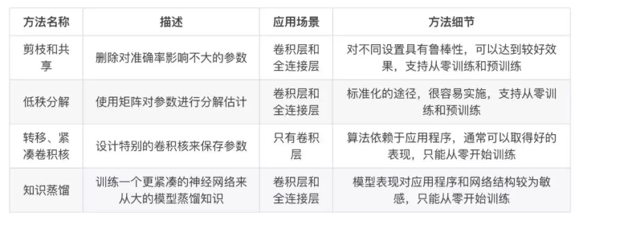
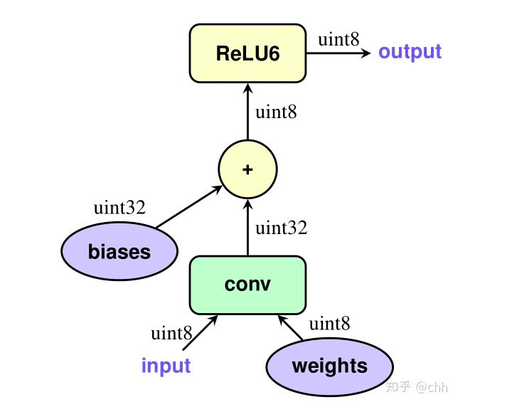
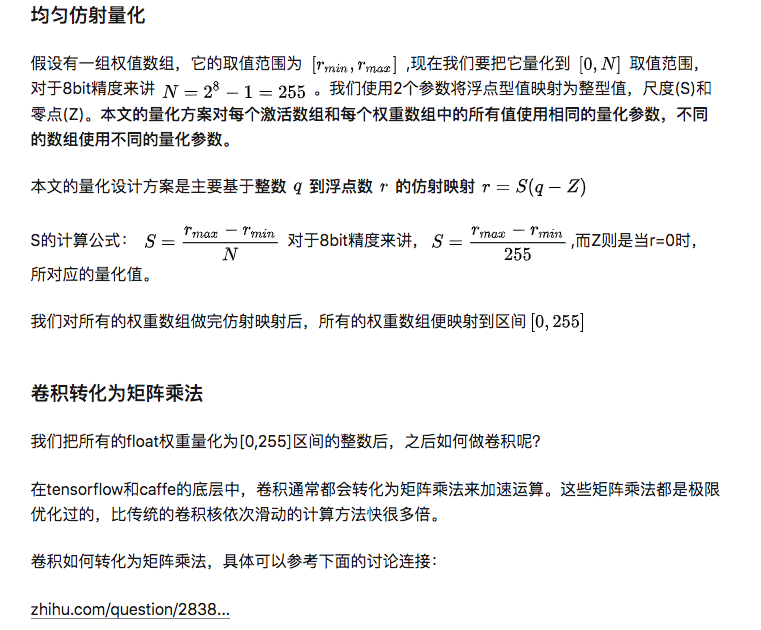
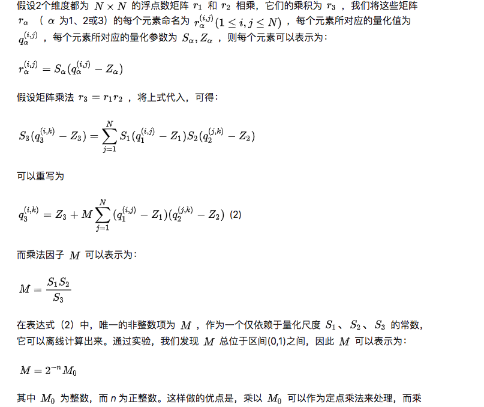
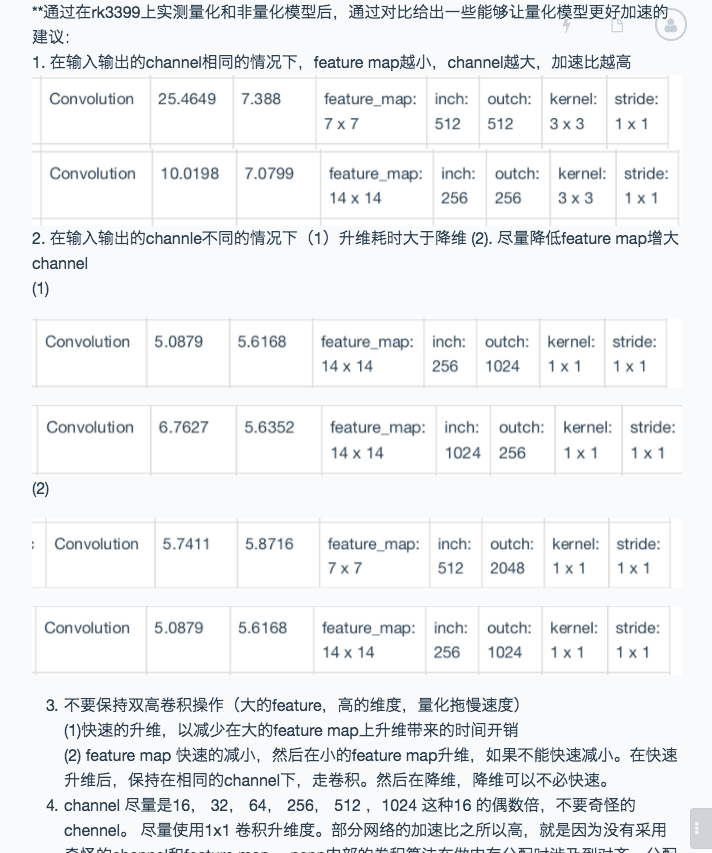
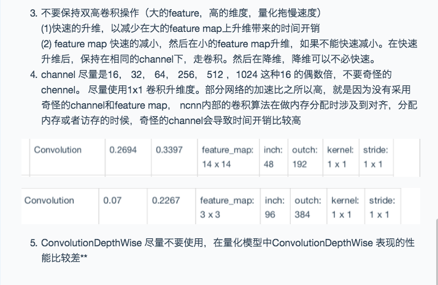

1. Krizhevsky 在 2014 年的文章中，提出了两点观察结论：卷积层占据了大约 90-95% 的计算时间和参数规模，有较大的值；
全连接层占据了大约 5-10% 的计算时间，95% 的参数规模，并且值较小。这为后来的研究深度模型的压缩与加速提供了统计依据

2. 一个典型的例子是具有 50 个卷积层的 ResNet-50 需要超过 95MB 的存储器以及 38 亿次浮点运算。在丢弃了一些冗余的权重后，
网络仍照常工作，但节省了超过 75％ 的参数和 50％ 的计算时间。当然，网络模型的压缩和加速的最终实现需要多学科的联合解决方案，
除了压缩算法，数据结构、计算机体系结构和硬件设计等也起到了很大作用。本文将着重介绍不同的深度模型压缩方法，并进行对比。

综合现有的深度模型压缩方法，它们主要分为四类： 

参数修剪和共享（parameter pruning and sharing） 

低秩因子分解（low-rank factorization） 

转移/紧凑卷积滤波器（transferred/compact convolutional filters） 

知识蒸馏（knowledge distillation） 

基于参数修剪和共享的方法针对模型参数的冗余性，试图去除冗余和不重要的项。基于低秩因子分解的技术使用矩阵/张量分解来估计深度学习模型的信息参数。基于传输/紧凑卷积滤波器的方法设计了特殊的结构卷积滤波器来降低存储和计算复杂度。知识蒸馏方法通过学习一个蒸馏模型，训练一个更紧凑的神经网络来重现一个更大的网络的输出。 

一般来说，参数修剪和共享，低秩分解和知识蒸馏方法可以用于全连接层和卷积层的 CNN，但另一方面，使用转移/紧凑型卷积核的方法仅支持卷积层。

低秩因子分解和基于转换/紧凑型卷积核的方法提供了一个端到端的流水线，可以很容易地在 CPU/GPU 环境中实现。

相反参数修剪和共享使用不同的方法，如矢量量化，二进制编码和稀疏约束来执行任务，这导致常需要几个步骤才能达到目标

这篇文章主要是对《Quantization and Training of Neural Networks for Efficient Integer-Arithmetic-Only Inference》这篇文献比较详细的解读，以及我自己从底层API开始搭起来的基于mobilenet-v2的实现。

论文链接：https://arxiv.org/abs/1712.05877

而下面这个是谷歌官方的量化白皮书，对量化技术进行了全面的详解，可以看做是论文的详细版本：https://arxiv.org/abs/1806.08342

（附：CSDN上的中文翻译https://blog.csdn.net/guvcolie/article/details/81286349）

文章仍有较多部分未完成，正在努力赶稿中。。

施工中

1. int8内部计算，首先卷积使用int8乘，然后转化为int32，然后在转化为f32，然后relu（f32+scale*bias） 最后将relu后的值转化为int8

### ncnn 量化方案 ： 

formal：

	float32 = (int8 - zero_point) * scale

BUG1989/caffe-int8-convert-tools ncnn量化模型转化工具

int8模型转化：
#### 1. weight 量化
	（1）权重的分布变化不大，且固定，采用固定值的对称量化。（-max，+max）
	（2）并不是每一层的layer对应一个weight_scale，而是layer对应的weight每一个通道对应一个weight_scale，降低精度对acc的影响。
#### 2. 激活之量化
	激活值对应不同的输入起分布变化较大，ncnn采用了两种量化方法：
	（1）没有校验数据， 类比weight，固定值。
	（2）有校验数据，采用采用tensorRT -》kl+smooth

int8模型inference：

	每一层layer在forward之前，经过一层（layer）quantized量化过程，将权重和激活的量化值准备好，然后在执行op的forward过程，执行完后，
	int8类型的结果值，在经过requantized反量化，将int32的值反量化（为什么要反量化）为float32，传递到下一层。
	
#### 为什么量化结果传递到下一层时要反量化？
    为了减少acc的降低，因为某一层经过int8的计算后，产生的结果要传递给下面的relu或者sigmod等函数，做非线性变化
    如果，不把结果反量化回来，直接将int8或者int32传入到后面的非线性计算，会导致acc的降低。
    
    
    
#### ncnn 量化规则

	